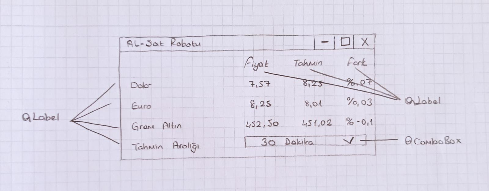

#alSatRobotu
1.  **Yazılım Tanımı**

Programın Adı: Al-Sat Robotu

Programlama Dilleri: Python

İşletim Sistemi: Microsoft Windows

Gerekli Kütüphaneler: bs4, pyqt5, mysql-connector, pandas, sklearn, lxml

Kaynak Kod Satır Sayısı: 222

2.  **Yazılım Tasarımı**

    a.  **Problemin Tanımlanması**

Dünyada bir çok insan borsalardaki yükselme ve düşmelerden para kazanır,
bunun asıl mantığı bir para birimi başka bir para birimi karşısında
değer kazanırken paranızı ona geçirip paranızın değer kaybetmesini
önlemek veya değer kazanmasını sağlamaktır. Fakat bu şekilde para
kazanmak borsaların çok hassas olmasından ve hiçbir zaman artacak mı
azalacak mı bilinememesinden dolayı oldukça zor ve risklidir. Çoğu kısa
vadeli al-sat yapan insan gününü elindeki son verileri kontrol edip
analiz ederek ve hangi para biriminin değer kazanacağını tahmin etmeye
çalışarak geçirir. Buradaki çözülmeye çalışılan problem hangi paranın
değer kazanacağını tahminleme işidir.

b.  **Programın Amacı**

Bu program internet üzerinde gerçek zamanlı verileri çekip bir
veritabanına kaydederek oluşan bu veriseti üzerinden yakın gelecekte
"Dolar", "Euro" ve "Gram Altın" paritelerinin "Türk Lirası" karşısında
sahip oldukları değerlere göre çalıştıktan sonra veritabanında
oluşturduğu verisetini kullanarak tahminlemesini yapacak ve anlık olarak
kullanıcı arayüzünü güncelleyerek anlık fiyat bilgisini, seçilen zaman
sonrası için yaptığı tahmini ve tahmin ile gerçek fiyat arasındaki fiyat
farkını kullanıcının düşüş ve artışı takip edebilmesi amaçlı
gösterecektir, bu sayede kullanıcının daha doğru yatırım yaparak daha
doğru kararlar verebilmesini amaçlamıştır.

c.  **Programın Tasarımı**

    i.  **Arayüz Tasarımı**

{width="5.5675667104111985in"
height="2.1759995625546806in"}

ii. **Algoritma Tasarımı**

1\. Başla\
2. Kütüphaneleri Ekle\
3. Uygulamayı Oluştur\
4. Gösterilecek pencereyi oluştur\
5. Gösterilecek pencerenin ızgarasını oluştur ve pencereye tanımla\
6. İnternet Veri Çekmesini Otomatikleştirmek için bir QTimer kullan ve
zamanını 10 saniyeye ayarla\
7. Fiyat Güncelle fonksiyonunu çalıştır\
8. Sırayla dolar, euro ve gram altın verisini internetten çekip bir
değişkenlere ata\
9. Yeni çekilen değer arayüze en son yazılmış değerden farklı mı?\
10. Hayır ise: Zamanlayıcının Fiyat Güncelleme fonksiyonunu
tetiklemesini bekle\
11. Evet ise: Arayüzdeki fiyat sütununu yeni verilerle güncelle\
12. Güncellenen verileri tarih ve saat bilgisiyle beraber veritabanına
ekle\
13. Veritabanında biriken verisetini kullanarak kullanıcının vermiş
olduğu adım sonrasını tahmin et\
14. Tahminlenen verilerle arayüzdeki \"Tahmin\" sütununu güncelle\
15. Tahminler ve güncel fiyat arasındaki farkın yüzdesini bul\
16. Bulunan yüzde farklarıyla arayüzdeki \"Fark\" sütununu güncelle\
17. Program kapatıldı mı?\
18. Hayır ise: Zamanlayıcının \"Fiyat guncelleme\" fonksiyonunu
tetiklemesini bekle\
19. Evet ise: Zamanlayıcıyı durdur ve veritabanını temizle\
20. Bitir

{width="6.3in" height="4.029166666666667in"}

3.  **Hatalar ve Eksiklikler**

Program internetten güncel fiyat verilerini çekmeye çalışırken eğer
verilerin çekildiği site cevap vermezse ve bağlantı kurulamazsa program
çöküyor. Bunun olmaması için eğer veri çekilemezse fonksiyon hata vermek
yerine tekrar bir 10 sn. daha beklemeye alınabilir.

Programdaki verisetinin ilk açılışta çok küçük olmasından dolayı program
açık durduğu süre boyunca ne kadar fazla veri biriktirirse o kadar iyi
tahminleme yapacaktır, ve tahmin aralığı ne kadar arttırılırsa o kadar
tahmin doğruluğu düşer. İnternetten güncel verileri çekmeden önce daha
önceki fiyat verileriyle de veritabanı beslenerek daha doğru ve tutarlı
tahminle ve uzun zaman aralıkları eklenebilir. Aynı zamanda daha çok
parite eklenerek program geliştirilebilir.

4.  **Ekran Görüntüleri**

{width="6.3in" height="3.417361111111111in"}

{width="6.3in" height="3.417361111111111in"}

{width="6.3in" height="3.089583333333333in"}
